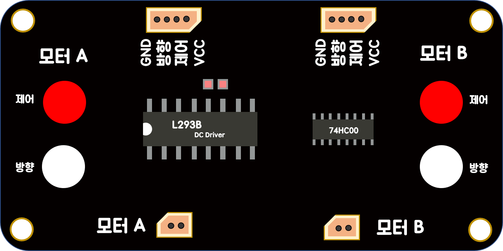
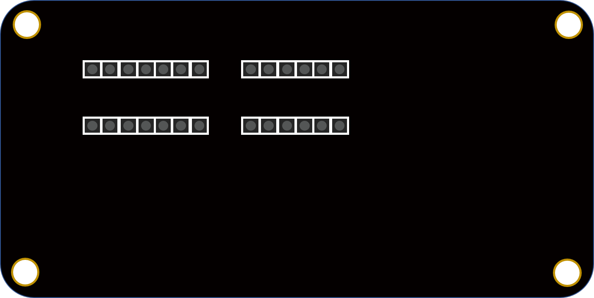

# 1. 모터 드라이버 스펙
## L293B 드라이버
 

전압공급 : 4.5V ~ 36V  
전류출력 : 1A 

 

DC전원어뎁터 5V 1~2A 의  파워가 필요합니다.

# 2. 핀 맵

- GND : 전원의 (-)핀
- 방향 : 모터의 회전방향을 결정하는 Digital핀. 
- 제어 : 모터의 속도를 결정하는 PWM핀.  0값은 정지를 의미한다.
- VCC : 전원의 (+)핀

이 모듈은 대장장이보드에 호환성 있게 쉴드형태로 제작되었으며, 동일한 기능을 하는 핀헤더가 추가적으로 배치되어 있어서 일반 아두이노에서도 사용가능하다.
 
따라서 모듈의 사용방법은 대장장이보드의 경우와 대장장이가 아닐때의 경우로 나뉘기 때문에
본인에게 맞는 환경의 설명을 참고하시기 바랍니다.
### 대장장이보드 (쉴드 사용)
1. 쉴드장착
2. 모터연결
3. 작동테스트
4. 엔트리 코딩
5. 주의사항

### 아두이노 (핀헤더 사용)
1. 케이블 연결
2. 모터연결
3. 작동테스트
4. 엔트리 코딩
5. 주의사항
